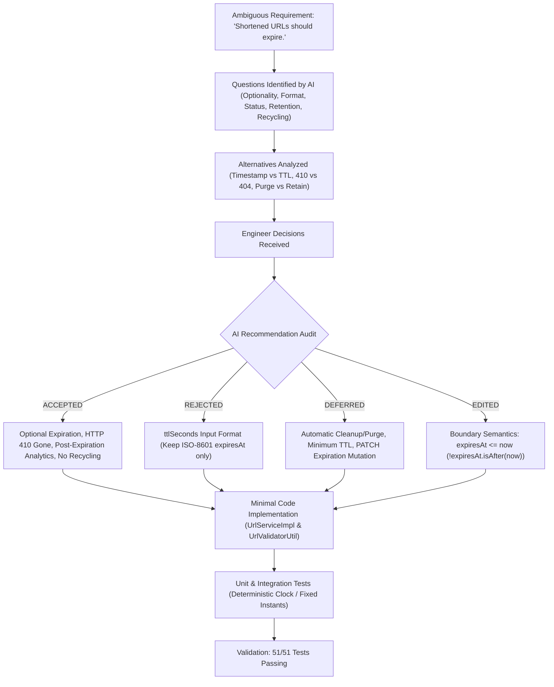

# Managing Ambiguity & Edge Cases – Ambiguous Requirement Resolution

## 1. Requirement Resolution Lifecycle: URL Expiration

---

## 2. Detailed Decision & Recommendation Audit

### Ambiguous Requirement
*"Shortened URLs should expire."*

### Key Questions Identified & Analyzed
1. **Is expiration mandatory or optional?**
   - *Decision*: **ACCEPTED** — Expiration remains optional (`expiresAt == null` means permanent lifetime). Preserves backward compatibility.
2. **Should there be a default expiration period?**
   - *Decision*: **ACCEPTED** — No default TTL is applied. `null` means infinite lifetime.
3. **How should users specify expiration (Timestamp vs TTL)?**
   - *Decision*: **REJECTED AI Recommendation** — Reject `ttlSeconds`. Support only ISO-8601 UTC `expiresAt` (`Instant`). Avoids DTO mutual-exclusivity validation and complex API semantics.
4. **What HTTP status code for expired redirects?**
   - *Decision*: **ACCEPTED** — Return `HTTP 410 Gone`. (Resource existed but is no longer available).
5. **How does expiration affect click counting?**
   - *Decision*: **ACCEPTED** — Click count is **not** incremented on expired redirects. Expiration check runs before atomic DB increment query.
6. **Are analytics accessible after expiration?**
   - *Decision*: **ACCEPTED** — Analytics endpoint (`GET /api/urls/{shortCode}/analytics`) returns `HTTP 200 OK` with full metrics post-expiration for historical auditing.
7. **Should expired records be cleaned up automatically?**
   - *Decision*: **DEFERRED** — No `@Scheduled` cron job or archival tables in prototype. Preserves historical metrics and avoids background infrastructure complexity.
8. **Can expired short codes or custom aliases be recycled?**
   - *Decision*: **ACCEPTED** — Codes and aliases must **not** be immediately reused. Unique DB index remains authoritative to prevent traffic hijacking.
9. **Can expiration be modified post-creation?**
   - *Decision*: **DEFERRED** — No `PATCH` endpoint. Expiration is immutable post-creation.
10. **Exact expiration boundary evaluation?**
    - *Decision*: **EDITED** — Refined boundary from `isBefore(now)` to `expiresAt <= now` (`!expiresAt.isAfter(now)`). Capture `Instant.now()` once per decision.

---

## 3. Minimal Implementation & Test Strategy

### Minimal Code Changes
- **[`UrlServiceImpl.java`](file:///c:/Users/erany/OneDrive/Desktop/schwab-ai-url-shortener/src/main/java/com/schwab/urlshortener/service/impl/UrlServiceImpl.java)**: Updated `resolveAndRedirect` to capture `Instant now = Instant.now()` once and evaluate `if (shortUrl.getExpiresAt() != null && !shortUrl.getExpiresAt().isAfter(now)) throw new UrlExpiredException(shortCode);`.
- **[`UrlValidatorUtil.java`](file:///c:/Users/erany/OneDrive/Desktop/schwab-ai-url-shortener/src/main/java/com/schwab/urlshortener/util/UrlValidatorUtil.java)**: Updated `validateExpiration` to `if (expiresAt != null && !expiresAt.isAfter(Instant.now())) throw new InvalidUrlException(...)`.

### Automated Test Coverage
- **Unit Tests**: Updated [`UrlValidatorUtilTest.java`](file:///c:/Users/erany/OneDrive/Desktop/schwab-ai-url-shortener/src/test/java/com/schwab/urlshortener/unit/UrlValidatorUtilTest.java) and [`UrlServiceImplTest.java`](file:///c:/Users/erany/OneDrive/Desktop/schwab-ai-url-shortener/src/test/java/com/schwab/urlshortener/unit/UrlServiceImplTest.java) to verify:
  - Active URL without `expiresAt`
  - Active URL with future `expiresAt`
  - Expired URL (`expiresAt < now`) returning `UrlExpiredException` without incrementing click count
  - Exact boundary instant (`expiresAt == now`) treated as expired
  - Analytics returning `200 OK` for expired URLs
- **Integration Tests**: Updated [`CustomAliasIntegrationTest.java`](file:///c:/Users/erany/OneDrive/Desktop/schwab-ai-url-shortener/src/test/java/com/schwab/urlshortener/integration/CustomAliasIntegrationTest.java) verifying custom alias expiration workflows.

---

## 4. Operational & Production Considerations

1. **Database Retention & Growth**: In production, unbounded storage of expired rows will eventually increase DB index size. A scheduled batch cleanup query (`DELETE FROM short_url WHERE expires_at < NOW() - INTERVAL '30 DAYS' LIMIT 1000`) should be deployed when storage thresholds warrant.
2. **Abuse / Minimum TTL**: To prevent short-lived link pollution attacks, production ingress proxies (Nginx/Gateway) should enforce rate limiting per client IP.
